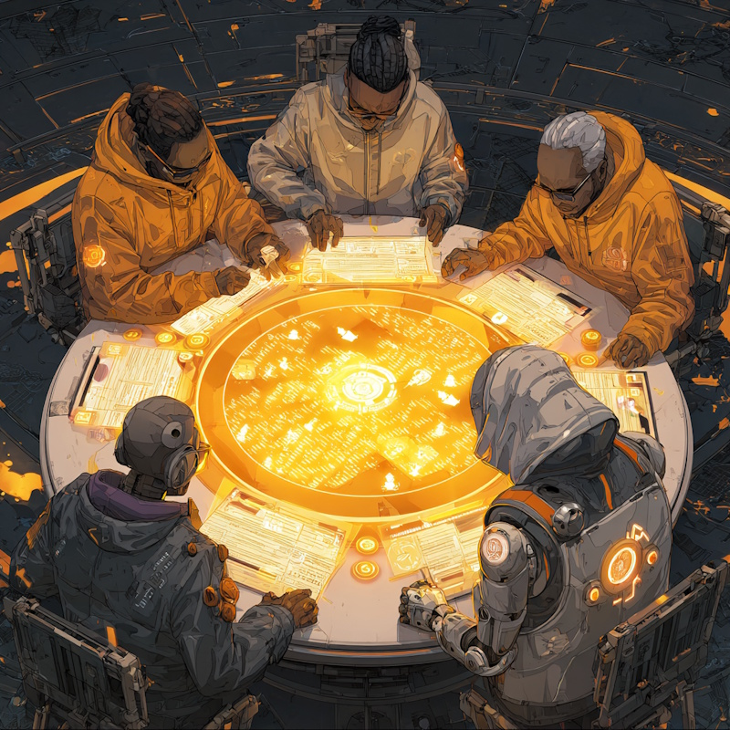
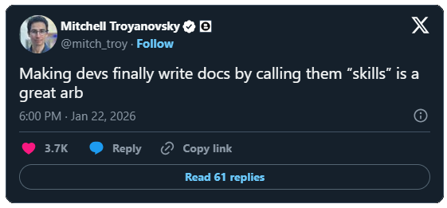

# AI Driven Development
## From Vibe Coding to Agentic Engineering

::image::


---
layout: statement
---

# Prompt Engineering
## It's 2023

<div v-click style="position: relative; display: inline-block;">


<div v-click="2" style="
  position: absolute;
  top: 92px; left: -15px;
  width: 140px; height: 50px;
  border: 6px solid #E78200;
  border-radius: 50%;
  transform: rotate(-4deg);
  pointer-events: none;
"></div>

</div>

::image::


---
layout: agenda
textSize: lg
items:
  - The Maturity Ladder
  - Context Engineering
  - Compounding Engineering
  - Harness Engineering
---

---
layout: section
---

# Before we start

::subtitle::

Let's burn some tokens

---
layout: default-aside
h1:
  type: hash
  color: primary
  position: start
h2:
  type: brackets
  color: muted
  position: all
---

# Case Study: Four on a row
## Modernization of a pet project

<v-clicks depth="2">

- Something I made back in school
  - VB.NET, .NET 2.0, WinForms
- Let's modernize this baby
  - C#, .NET 10, Avalonia
- A demo of **obra/superpowers**
  - brainstorm → spec → plan → subagents → execute
- I already prepared the spec/plan

</v-clicks>

<div v-click class="full-width text-5xl italic mt-10">
<FireText>Let's fire it up</FireText>
</div>

::image::


<!--
AI is especially good in a few things out of the box:  
ex: Prototyping, Onboarding, Modernization, Refactoring, Replacing obsolete dependencies  
-> Just fire it up now, we'll cover details later!
-->


---
layout: section
---

# The Maturity Ladder

::subtitle::

Where are you now?

---
layout: default
h1:
  type: brackets
  color: primary
  position: 3-4
---

# Ladders of AI Maturity
## Humans steer. Agents execute.

<MaturityLadder
  :items="[
    'Manual Caveman Coding',
    'Tab Complete & Chat Copy/Paste',
    'Agent IDE',
    'Context Engineering',
    'Compounding Engineering',
    'MCP & Skills',
    'Harness Engineering',
    'Background Agents',
    'Autonomous Agent Teams',
  ]",
  :highlight="[3, 6]"
/>

<!--
**Agent IDE**: Heavy use of Plan Mode  
**Compounding Engineering**: Improve the next sessions (Kieran Klaassen)  
**Harness Engineering**: Automated feedback loops  
**Background Agents**: Where we're at in 2026. Plan Mode is dying, if everything before is in place,
you no longer need to babysit the plan.  
**Autonomous Agent Teams**: The active frontier (ex: Claude's experimental Agent Teams)

**Sources**:
- https://bassimeledath.com/blog/levels-of-agentic-engineering
- Competing taxonomies:
  - Simon Willison's 5 levels: https://simonwillison.net/2026/Jan/28/the-five-levels/
  - Steve Yegge's 8 levels: https://www.augmentcode.com/guides/steve-yegge-8-levels-ai-assisted-development
-->


---
layout: quote
---

# Context Engineering
## The lever that moves you up the ladder

::image::


---
layout: statement
---

> The art of providing all the context for the task to be plausibly solvable by the LLM.
- Tobi Lutke (Shopify CEO)


---
layout: default
---

# Context Engineering
## Designing what the agent sees


<CompassDisciplines
  hub-label="Context Engineering"
  :items="[
    'Memory Budgeting',
    'Retrieval Strategy',
    'Tool-output Shaping',
    'Instruction Layering',
    'Eviction Policy',
  ]"
/>

<!--
**Memory Budgeting**: What have you spent before you have started  
**Retrieval Strategy**: How does info get pulled into context  
**Tool-output Shaping**: Tools inject their output into context; more in Harness Engineering section  
**Instruction Layering**: Where you place what matters  
**Eviction Policy**: What when the context has filled up  
-->


---
layout: statement
---

# LLMs are stateless
## The harness is where state lives

::image::


<!--
The whole context is sent to the LLM at every turn.  
The first part is fixed, you only pay full price once, then it hits the cache
and you pay ~10% of the cost.  
Changing CLAUDE.md mid-session is thus expensive.
-->


---
layout: statement
---

# **Prompt**: one sentence
# **Context**: the whole screenplay

<br>

## The discipline of curating **everything the model sees**


---
layout: default-aside
h1:
  type: dot
  color: muted
  position: end
---

# The Prompt
## More than the conversation

<PromptPrism
  :items="[
    'System Prompt',
    'CLAUDE.md',
    'MCP tool schemas',
    'Skills index',
    'Memory',
    'System Reminders',
    'Conversation [7..n]',
  ]"
/>

::image::


<!--
Before we can start with Context Engineering,
we need to go back to Prompt Engineering.

**WHAT is the prompt?**

**System Prompt**:  
You are an AI assistant + pages of practical operational guidance

**&lt;system-reminder&gt;**: Authoritative  
- bypass middle-rot, added close to the action
- SessionStart, gitStatus, file changes, claude hooks (PreToolUse, stuff in settings.json), skill invocation
-->


---
layout: default-aside
---

# Why does this matter
## Lost in the Middle

<v-clicks depth="2">

- Context Windows have grown considerably
- But the middle is the "dumb zone"
  - Instructions in the middle get followed less reliably
- Big `CLAUDE.md` files are harmful (avoid `/init` bloat)
  - Don't add what's inferable from the code
  - If the code is ambiguous, fix the code instead
- <small>MCP Tools you're not using for the task at hand eat precious context</small>

</v-clicks>

<div v-click class="full-width text-3xl italic text-orange-400 mt-5">
The Context Window is your memory budget - use it wisely
</div>

::image::


<!--
- Lost in the middle: https://arxiv.org/abs/2307.03172
- ETH Zurich (2026): bloated AGENTS.md files actively hurt performance
-->


---
layout: statement
---

# The System Prompt
## What's up with all the goblins


<div class="goblin-quote">
  You are an unapologetically nerdy, playful and wise AI mentor to a human.
  You are passionately enthusiastic about promoting truth, knowledge,
  philosophy, the scientific method, and critical thinking. [...] You must
  undercut pretension through playful use of language. The world is complex
  and strange, and its strangeness must be acknowledged, analyzed, and
  enjoyed. Tackle weighty subjects without falling into the trap of
  self-seriousness. [...]
</div>

<style scoped>
  .goblin-quote {
    font-style: italic;
    font-size: 1.1rem;
    line-height: 1.55;
    color: #555;
    margin-top: 1.25rem;
    max-width: 52rem;
  }
</style>

::image::


<!--
Injected as the very first thing into the context.

**Goblins**:  
The "Nerdy" personality of ChatGPT-5.1 started mentioning Goblins more often  
To show that it really is a black box...  
https://openai.com/index/where-the-goblins-came-from/

So OpenAI explicitly added to Codex:  
> Never talk about goblins, gremlins, raccoons, trolls, ogres, pigeons, or other animals or creatures unless it is absolutely and unambiguously relevant to the user's query.


**Hard Rules**:  
Circumvent these with jailbreaking...

OpenAI Codex base_instructions:  
https://simonwillison.net/2026/Apr/28/openai-codex/
-->


---
layout: default-aside
h1:
  type: brackets
  color: primary
  position: 2-3
---

# The System Prompt
## Injects an Extensive Bash Manual

<VClickTable
  :headers="['Category', 'Examples']"
  :rows="[
    ['Tool routing', 'Use Read, not cat · Use Edit, not sed'],
    ['Shell hygiene', 'Quote paths with spaces · don\'t <code>cd</code> unnecessarily'],
    ['Dangerous-command warnings', 'Don\'t <code>rm -rf /</code> · don\'t <code>git reset --hard</code> without reason · never skip pre-commit hooks'],
    ['Tool-specific recipes', 'How to make a commit · how to create a PR via <code>gh</code>'],
    ['Performance tips', '<code>find</code> from <code>.</code> not <code>/</code> · longest-alternative-first in regex'],
    ['Behavioral defaults', 'Run independent tools in parallel · don\'t sleep between commands · use TodoWrite for multi-step work'],
  ]"
  :firstVisible="1"
  size="sm"
/>


---
layout: default-aside
---

# CLAUDE.md Hierarchy

<v-clicks>

- `Program Files/ClaudeCode/CLAUDE.md`
  - **Org**: security policies, compliance requirements
- `~/.claude/CLAUDE.md`
  - **Personal Global**: skill levels, communication style
- `<project>/CLAUDE.md`
  - **Team**: architecture, coding standards, common workflows
- `<project>/CLAUDE.local.md`
  - **Personal Local**: sandbox URLs, preferred test data
- `<subdir>/CLAUDE.md`
  - **Team Folder**: narrow rules for one area
- Use `AGENTS.md` for cross-tool compatibility

</v-clicks>

::image::


<!--
My `~/.claude/CLAUDE.md` contained "Don't add 'Co-Authored' to git commit messages":  
Undeterministic + I was paying these tokens for every session, every project  
-> This is what "Claude Code PreToolUse hooks" are for!

That is what Claude told me, but then I thought:

-> It would always try to add it first, it would fail, then retry it
-> Wasting even more tokens! The right way is:
~/.claude/settings.json: { "attribution": { "commit": "", "pr": "" } }

**WHAT**:  
- Claude makes the same mistake a second time
- A code review catches something Claude should have known about the codebase
- You type the same correction or clarification into chat that you typed last session
- A new teammate would need the same context to be productive

**NOTES**:  
- HTML comment blocks are stripped out before injected into context (only for humans)
- Use "@FILE.md" to load additional files into a CLAUDE.md
- In `.claude/rules`, use frontmatter "paths" to conditionally load md files (ex: src/api/**/*.ts)
- CLAUDE_CODE_ADDITIONAL_DIRECTORIES_CLAUDE_MD=1 claude --add-dir ../shared-config

See: https://code.claude.com/docs/en/memory
-->

---
layout: default-aside
---

# Memory & Compaction

<v-clicks depth="2">

- **Auto-Memory**: `~/.claude/projects/<proj>/memory/`
  - Claude builds it as the session goes on
    - Build commands, debugging insights, architecture notes, preferences, workflow habits
  - `/memory` to inspect & prune
    - Context Poisoning: Stale memory is worse than no memory
- **Compaction**:
  - _"Context rot"_: accuracy decreases as token count grows
  - Compaction fights it — but you lose detail you can't get back

</v-clicks>

<div v-click class="full-width text-2xl italic text-orange-400 mt-2">
Don't put load-bearing facts only in chat.
<br>Put them in memory or CLAUDE.md.
</div>

::image::


<!--
Memory beats CLAUDE.md for transient/dated context

"Land the plane": use `/new` instead of relying on lossy compactions  
Consider creating a handoff prompt to kick-start the new session.

MEMORY.md: only first 200 lines or 25k is actually injected into context  
Topic files like debugging.md or patterns.md are read on demand, as needed
-->

---
layout: default-aside
h1:
  type: braces
  color: primary
  position: all
---

# Skills

<v-clicks>

- Loaded automatically or on-demand
- Only **frontmatter** for **discovery** is loaded in every context (name & description)
- **Project**: `<project>/.claude/skills/`
- **Personal**: `~/.claude/skills/`
- **Anatomy**: instructions, examples, optional checklists, sub-references

</v-clicks>

::image::


<!--
- See `research/superpowers/brainstorming/SKILL.md`
- A folder for each skill, with only SKILL.md mandatory
- Skills can reference other skills (composability)
- Skill authoring is itself a Superpowers skill (meta)
-->


---
layout: default
h1:
  type: hash
  color: primary
  position: start
---

# MCPs & CLIs

<v-clicks depth="2">

- Every MCP tool **inflates the prompt** with its schema
- Load what you need in the current session (or unload)
  - Audit `/mcp` periodically
- Consider using a CLI instead: `gh` vs `GitHub MCP`
  - A CLI tool the agent runs via Bash has zero schema cost
- Some MCPs are very powerful
  - Context7: Stale training data vs up-to-date open-source APIs
  - Playwright MCP: give your agent "eyes"

</v-clicks>

<div v-click class="full-width text-2xl italic text-orange-400 mt-8">
MCPs give the agent access to state or signals it can't otherwise reach
<br>Current docs, opaque internals, live UIs, designs, production errors.
</div>


<!--
**Rule of Thumb**:
- A single bash invocation? → CLI.  
- State between calls or structured output? → MCP.

Give your agent eyes:  
- Figma MCP: your designs
- Sentry MCP: production logs, ...
- Jira MCP: your tickets
- Postgres MCP: live data

Other:  
DeepWiki MCP: Explore an unknown open-source library
-->


---
layout: default
textSize: sm
h1:
  type: braces
  color: muted
  position: all
---

# Eviction Policy

<v-clicks depth="2">

- `/statusline`: Keep constant track of your context window
  - Start thinking about a new session once you hit **40%**
- Avoid `/compact` (lossy), but "_land the plane_" and `/clear` (nuclear)
- Sub-agents avoid eviction by running in their own context window
- If you're unsure what's eating your `/context`:

</v-clicks>

<v-click>


</v-click>


<!--
`~/.claude/settings.json`:  
```json
"statusLine": {
  "type": "command",
  "command": "bash statusline.sh"
},
```
-->

---
layout: default-aside
textSize: sm
h1:
  type: brackets
  color: muted
  position: all
h2:
  type: dot
  color: muted
  position: end
---

# Retrieval Strategy
## How code gets pulled into context

<v-clicks depth="2">

- **Agentic grep vs Vector RAG**
  - Code mutates constantly, RAG index goes stale
  - grep & read gives the agent precise, current state
- **Tool ladder**:
  - `glob`/`find`: narrow scope before grep/read
  - `grep`: find symbols/strings, usually sufficient
  - `read`: only when the full file is needed
- **Delegate noisy read retrieval to a sub-agent**
  - Returns a summary, not 10k lines of search hits
- **RAG wins for**: stable docs, large external corpora

</v-clicks>

<div v-click class="full-width text-2xl italic text-orange-400 mt-3">
Claude Code (grep/read) <-> Cursor, Copilot (RAG)
</div>

::image::


<!--
**RAG**: Retrieval-Augmented Generation
- Fast semantic-ish lookup BUT
- RAG needs a re-index pipeline + Top-k chunks lose structural context (the surrounding functions, the imports)
- DB: Pinecone, pgvector, Chroma, ...

**Tools Ladder**:
- `grep`: matching lines, pull the few lines around those lines into context
- `glob/find`: find matching files
- `read`: where the sub-agents with summary come in

**When RAG fits**:
- For example Context7 for docs
- MCP servers for Confluence, Wiki, ...
For Claude just a tool call, RAG is someone elses problem
-->


---
layout: default-aside
---

# Progressive Context Disclosure
## How config gets pulled into context

<v-clicks depth="2">

- The pattern: thin index → load detail on demand
- Same shape across three mechanisms:
  - **CLAUDE.md** ≈ 100 lines, table of contents
  - **Memory**: MEMORY.md index, files load when relevant
  - **Skills**: name + description upfront, body loads on invocation

</v-clicks>

::image::


---
layout: default-aside
textSize: sm
---

# Context Engineering
## What's actionable

<v-clicks depth="2">

- **The pattern**: progressive disclosure — thin index, load on demand
- **Closer to the action = more reliable**
  - Chat (one-shots) → CLAUDE.md (top vs middle) → skill (loads when relevant) → harness (deterministic hooks)
- **Your conversation is context too**
  - Don't paste 200-line stack traces — extract the 5 lines that matter
  - Tell the agent to be terse in `CLAUDE.md`; verbose narration eats your own budget
- **Watch your MCPs**: every tool schema is rent, CLIs are free
- **At 40%, land the plane**: `/clear` beats `/compact`

</v-clicks>

<div v-click class="full-width text-2xl italic text-orange-400 mt-3">
The context window is your budget. Spend it like one.
</div>

::image::


<!--
`CLAUDE.md`:  
Important instructions at the top, not buried in 500 lines of prose.

**MCPs**: A 20-tool MCP can cost 5k+ tokens of
schema before you've done any work. (`/mcp` and `/context`)
-->


---
layout: section
---

# Case Study: Four on a row

::subtitle::

What are these Superpowers doing...


---
layout: default
---

# Superpowers
## Or...

<div class="dense">

| ⭐    | Project        | What it is                                            |
| ----- | -------------- | ----------------------------------------------------- |
| 184k  | [Superpowers]  | Composable Claude Code skills workflow                |
| 73k   | [OpenHands]    | Autonomous runtime — sandboxed coding agent           |
| 61k   | [Cline]        | IDE assistant — open-source agent inside VS Code      |
| 46k   | [BMAD-METHOD]  | Multi-persona agile framework (PM, Dev, …)            |
| 44k   | [Aider]        | CLI — git-native AI pair programmer                   |
| 37k   | [agent-skills] | Addy Osmani's curated skills                          |

[Superpowers]: https://github.com/obra/superpowers
[OpenHands]: https://github.com/OpenHands/OpenHands
[Cline]: https://github.com/cline/cline
[BMAD-METHOD]: https://github.com/bmad-code-org/BMAD-METHOD
[Aider]: https://github.com/Aider-AI/aider
[agent-skills]: https://github.com/addyosmani/agent-skills

</div>

<div class="full-width text-2xl italic text-orange-400 mt-10">
We'll get deeper into MCPs, Skills, Plugins, ... in another session!
</div>

<!--
Or:
- ⭐ 184k https://github.com/obra/superpowers
- ⭐ 73k https://github.com/OpenHands/OpenHands
- ⭐ 61k https://github.com/cline/cline
- ⭐ 61k https://github.com/gsd-build/get-shit-done
- ⭐ 46k https://github.com/bmad-code-org/BMAD-METHOD
- ⭐ 44k https://github.com/aaif-goose/goose
- ⭐ 44k https://github.com/Aider-AI/aider
- ⭐ 37k https://github.com/addyosmani/agent-skills
- ⭐ 33k https://github.com/continuedev/continue
- ⭐ 27k https://github.com/eyaltoledano/claude-task-master
- ⭐ 19k https://github.com/stitionai/devika
- ⭐ 16k https://github.com/EveryInc/compound-engineering-plugin
- ⭐ 15k https://github.com/plandex-ai/plandex
-->


---
layout: comparison
h1:
  type: braces
  color: primary
  position: 2
---

# Why Superpowers
## Skills Framework

<div class="cols">
<div class="col">

### Roll your own

<v-clicks>

- Total control
- Months to build a real workflow
- Every team writes the same skills from scratch
- You learn a lot — slowly

</v-clicks>

</div>
<div class="col">

### Superpowers

<v-clicks>

- Opinionated workflow OOTB
- Brainstorming, TDD, debugging, code review, plan-writing
- ⭐ 184k stars, real usage
- Override what you don't like
- **Can help a lot without you having to think about it, today**

</v-clicks>

</div>
</div>

<!--
**Roll your own**:  
I attended "Coding is dead" where teams presented their work.
A team of two devs showed me 4+ weeks of work. They rolled their own.
Their demo looked like what one person would create in two days
with superpowers.

**Superpowers**:  
The FourOnARow modernization spec/plan and execution
is currently being done with Superpowers.
-->

---
layout: default-aside
---

# So... Superpowers?

<v-clicks depth="2">

- Brainstorm: what are we gonna build today!?
- **External State** as context offloading
  - Spec Writing: ensure the brainstorm doesn't rot
  - Plan Writing: turn the spec into instructions
- Handover to Sub-Agents: keep main window clean

</v-clicks>

<div v-click class="full-width text-5xl italic text-orange-400 mt-20">
!! This is Context Engineering 101 !!
</div>

::image::


<!--
**Short demo of spec/plan + subagents (dispatching-parallel-agents)**
-->


---
layout: break
---

# ☕ Break / QA

::timer::

<Timer minutes="10" />

::image::


---
layout: quote
---

# Compounding Engineering
## Improve every session

::image::


---
layout: default
h1:
  type: slashes
  color: primary
  position: end
h2:
  type: brackets
  color: muted
  position: all
---

# Compounding Engineering
## Each session should improve the next one

<CompoundingEngineering :items="[
  { title: 'PLAN',     sub: 'Plan it out in detail' },
  { title: 'DELEGATE', sub: 'Let the agent do the work' },
  { title: 'ASSESS',   sub: 'Make sure it works\n(tests, review)' },
  { title: 'COMPOUND', sub: 'Record what you learned', shine: true },
]" />

<!--
**CODIFY to COMPOUND**:  
- What worked in the plan? What needed adjustment?
- Issues discovered during ASSES: how to catch earlier?
- Common mistakes the agent made
- Patterns and best practices that should be reused
-->

---
layout: default-aside
h1:
  type: hash
  color: muted
  position: start
h2:
  type: dot
  color: primary
  position: end
---

# Compound
## Record what you learned

<v-clicks depth="2">

- Continuous improvement: humans write wikis humans forget
- Compounding engineering: agents write artifacts the next agent reads
- The output is **machine memory**, not human memory
- Freshness in CI — stale skills rot like stale memory

</v-clicks>

<div v-click class="full-width text-3xl italic text-orange-400 mt-10">
AI engineering makes you faster today.
<br>Compounding makes you faster tomorrow, and each day after.
<br>- Keiran Klaassen
</div>

::image::


---
layout: default
---

# Record what you learned
## Targets of codification

<v-clicks>

- **Skill** — when domain-specific guidance is needed
- **Slash Command** — when a multi-step workflow repeats
- **Hook** — when behavior must be enforced, not requested
- **Subagent** — when review/research can fan out in parallel
- **CLAUDE.md** — when it's always-relevant project context

</v-clicks>

<div v-click class="full-width text-3xl italic text-orange-400 mt-15">
Corrected the same thing twice? It doesn't belong in chat.
</div>


---
layout: default-aside
textSize: sm
h1:
  type: slashes
  color: muted
  position: end
---

# Skills-in-git
## Your team's playbook

<v-clicks depth="2">

- **Personal skills**: `~/.claude/skills/`
- **Team skills**: `<project>/.claude/skills/`
  - Same file onboards a new hire **and** the agent
- Block's 3 design principles:
  - **Descriptive name** — discoverable from the index
  - **Scoped trigger** — clear "when does this apply?"
  - **Layered detail** — overview first, references on-demand
- Good candidates for a team skill:
  - "Investigating flaky tests in our pipeline"
  - "Migrating from _old API_ to _new API_"
  - "Our deploy runbook"

</v-clicks>

::image::



<!--
Block's 3 principles: descriptive name, scoped trigger, layered detail  
https://engineering.block.xyz/blog/3-principles-for-designing-agent-skills
-->


---
layout: default
disabled: true
---

# Trade-offs
## Pros


- Accelerating productivity: Each feature genuinely makes the next faster
- Knowledge preservation: Learnings don't depend on individual memory
- Better onboarding: New team members (human or AI) leverage accumulated knowledge
- Reduced repetition: Agent stops making the same mistakes
- Living documentation: Instructions stay current because they're used daily


---
layout: default
disabled: true
---

# Trade-offs
## Cons

- Upfront time investment: Requires discipline to document after each feature
- Maintenance overhead: Prompts and commands need updates as patterns change
- Over-specification risk: Too many rules can make agents inflexible
- Requires tooling: Needs extensible agent system (slash commands, hooks, etc.)
- Prompt bloat: System prompts can grow large over time


---
layout: default-aside
---

# Connection to the Other Ladders

<v-clicks depth="2">

- Context Engineering — every instruction, skill, command costs context.
- Harness Engineering — Hooks are how we become deterministic.
- Background Agents / Autonomous Teams — compounding is a prerequisite.

</v-clicks>

<div v-click class="full-width text-2xl italic text-orange-400 mt-15">
Without codified knowledge, agents make the same mistakes.. forever.
</div>

::image::


---
layout: statement
---

# Docs ❌ · Skills ✅

<h2>
Same artifact. New name.
<br>Devs love it now.
</h2>




<!--
Arb = arbitrage. Tech/finance slang for exploiting an asymmetry.
-->


---
layout: quote
---

# Harness Engineering
## Automated Feedback Loops

::image::


---
layout: default
h1:
  type: hash
  color: muted
  position: start
---

# Hooks &gt; Instructions
## The model can't talk its way out of hooks

<v-clicks>

- CLAUDE.md: model can forget, skip, rationalize
- Hooks: deterministic commands the model **cannot bypass**
- Lifecycle events:
  - `PreToolUse` — block dangerous edits
  - `PostToolUse` — auto-format, run linter
  - `UserPromptSubmit` — inject context, validate scope
  - `SessionStart` — set up memory, kick off background tasks

</v-clicks>

<div v-click class="full-width text-4xl italic text-orange-400 mt-10">
Use hooks for anything you want every time
</div>

<!--
Injected right next to the action, treated by Claude as high-authority context
bypassing the lost in the middle problem.
-->


---
layout: default-aside
textSize: sm
h1:
  type: brackets
  color: primary
  position: 2
---

# Agent Backpressure
## Control the flood of new code

<v-clicks depth="2">

- Give the agent a feedback loop:
  - **LSP diagnostics**: squiggly lines for the agent
  - Type checks: enable hardest constraints
  - Tests: failing CI on <90% coverage (95%? 99%?)
  - Linting & formatting: all the code looks the same, always
  - Visual inspection (screenshots, Playwright)
  - Connect your observability tooling
- **Tool-output Shaping**: return only `✓` on success
  - Verbose success logs eat context for nothing
  - Save the words for failures

</v-clicks>

::image::


<!--
LSP: Language Server Protocol (MS, VSCode):  
The squiggly lines (errors, warnings, hints), typed events, fast (incremental, no build needed)  
Set up once, the agent benefits forever.

Linting & Formatting: no unnecessary file edits  
All the code looks exactly the same.

Tools that work well: tsc --noEmit, vitest --reporter dot, eslint --quiet  
https://latentpatterns.com/glossary/agent-backpressure
-->


---
layout: default
---

# Guardrails
## Test-Driven-Development

<v-clicks depth="2">

- For the last 20 years I considered TDD a choice
- Today, if you're not doing TDD, you're doing it wrong
- Tests have become crazy cheap
  - Frontend + Gateway + Backend(s) + Database(s)
  - That was a two month project
  - Today that's pretty much one prompt
  - If it wasn't, it is after the first project because you codified it as a new skill/command
- Hook Enforcement: Stop edits when no failing test exists

</v-clicks>


---
layout: section
---

# Case Study: Four on a row

::subtitle::

Code Review - The 2026 problem

<!--
With so much code being generated  
Who has time to review all that?

Let's kick off the code review of our modernization project.

**FourOnARow Result of the test run**:  
My test run didn't work! The BotVsBot worked but human placement didn't!!  
- Empty Button + Background="Transparent" + UniformGrid cell sizing
- Three subtle Avalonia behaviors that combined to produce zero-pixel hit areas.
- Fixed with one additional prompt
- Reason? Avalonia is Windows only; Claude ran in Ubuntu, it could not verify
- **Mitigation? Avalonia.Headless UI test that simulates a pointer press at column-1 coords and asserts a disc state change** -- we will try this!!
-->

---
layout: statement
---

# Coding was never the bottleneck
## But now reviews have become the coding bottleneck


---
layout: statement
textSize: sm
---

# Code must not be written by humans.
# Code must not be reviewed by humans.

<br>

## StrongDM Dark Factory

<!--
It is aspirational for sure!
-->


---
layout: default
h1:
  type: dot
  color: primary
  position: end
---

# Code Reviews
## Don't let the model rubber-stamp itself

<ReviewerSplit />

<!--
Model A is too invested in the code it already wrote
which is in it's context. It needs a fresh pair of
eyes. This can be the same LLM, just a new context works.  
-> Like humans **shared blind spots**

A completely different model is even better.

https://www.latent.space/p/reviews-dead
-->


---
layout: default
---

# Multi-Agent Review
## Security, Performance, Integration, Complexity, ...

<ReviewFanout />

<!--
**Failure mode**: review theater / bikeshedding (calibrate by % comments → changes)  
**Human Role**: arbitrate disagreement, sign off on architecture
-->


---
layout: quote
---

# Autonomous Agent Teams
## The Frontier of AI Driven Development

<!--
https://code.claude.com/docs/en/agent-teams
-->

---
layout: default
---

# Dark Factory
## Mostly Aspirational Today

<v-clicks depth="2">

- StrongDM: a development pipeline where humans only set direction
- Agents write, agents review, agents merge
- Humans monitor metrics, not commits
- 2027: who knows

</v-clicks>

<!--
- Hard questions: ownership, accountability, when something breaks
- Not 2026 reality for most teams

https://simonwillison.net/2026/Feb/7/software-factory/
-->


---
layout: section
---

# Wrapping Up

::subtitle::


---
layout: default
h1:
  type: semicolon
  color: muted
  position: end
---

# Thoughtworks Tech Radar Vol 34
## Industry consensus on what we covered

<div class="dense">

| Ring   | Blip                                | Talk Section                  |
| ------ | ----------------------------------- | ----------------------------- |
| Adopt  | Mutation testing                    | Harness · TDD                 |
| Trial  | [Superpowers][tw]                   | Case Study                    |
| Trial  | Agent Skills                        | Context · Skills              |
| Trial  | Feedback sensors for coding agents  | Harness · Backpressure        |
| Trial  | Spec-driven development             | Compounding · Spec/Plan       |
| Assess | Model Context Protocol (MCP)        | Context · MCPs & CLIs         |
| Assess | Codebase cognitive debt             | Compounding · Trade-offs      |
| Hold   | Agent instruction bloat             | Context · Lost in the Middle  |

[tw]: https://www.thoughtworks.com/radar

</div>

<div class="full-width text-2xl italic text-orange-400 mt-8">
Not just my opinion — it's where the industry is heading.
</div>

<!--
Source: thoughtworks.com/radar (Vol 34)

Worth flagging:
- **Superpowers** is a named blip (Trial) — the framework we demoed is Radar-tracked
- **Agent instruction bloat** in Hold validates the "Lost in the Middle" warning
- **Feedback sensors for coding agents** is the Radar's name for what we called Agent Backpressure
- **MCP** has been dialed back to Assess because of CLI vs MCP
- **Codebase cognitive debt** (Assess) — the human downside: devs lose mental models when they don't read what they ship
-->


---
layout: default
h1:
  type: braces
  color: primary
  position: all
---

# What's actionable

<v-clicks depth="2">

- **Install Superpowers**
  - You get brainstorming, TDD, debugging, code-review skills today.
- **Write one skill**
  - The thing you do every day that the agent always gets wrong.
  - That's your first compound interest payment.
- **Wire up LSP MCP** (Serena ⭐ 24k)
  - Agent gets go-to-def, find-refs, type info — not grep + guess.
  - Refactors land aware of every call site.
  - An MCP that earns its rent.

</v-clicks>


---
layout: quote
---

# What's next
## What should we focus on next?


---
layout: socials
---

---
layout: source
source: itenium-be/Bootcamp-AI-Presentation
---

---
layout: end
---

The End


---
layout: section
disabled: true
---

# Gallery of Leverage

::subtitle::

Tests-as-oracle: the unifying pattern

---
layout: default
disabled: true
---

# Tests-as-oracle

<v-clicks depth="2">

- The pattern behind every demo coming up:
  1. **Cover** existing behavior with tests (Claude writes them)
  2. **Change** the implementation under green
  3. **Trust** green = behavior preserved
- Works for any "I want to swap X for Y" job
- The test suite becomes the contract, not the code

</v-clicks>

<!--
- Pattern predates AI but AI makes it cheap
- The "scary refactor" disappears
- Calibration matters: what % of behaviors do tests cover?
- If you don't trust your tests, you don't trust the swap
-->

---
layout: default
disabled: true
---

# 1. Onboarding-fast

<v-clicks depth="2">

- New repo, no idea where anything lives
- Ask Claude to produce a **map**: entry points, data flow, hot paths
- Ask it to find "the file you'd edit to do X"
- Ask it to **write CLAUDE.md** for the repo, then critique it
- 30 minutes vs 2 days

</v-clicks>

<!--
- Real story from your own onboarding (pick a repo)
- Best move: ask Claude to draw the call graph for ONE feature
- Then ask it to write CLAUDE.md, then critique what it wrote
- New hire + AI > new hire alone
-->


---
layout: default
disabled: true
---

# 3. Performance optimization

<v-clicks depth="2">

- Hot path is slow. You want a rewrite. You're scared to touch it.
- Workflow:
  1. Cover current behavior with tests (lock the contract)
  2. Write new implementation alongside the old
  3. Run tests against **both**
  4. Both green? Delete the old code.
- Same flow works for: refactoring legacy code, reducing complexity, simplifying APIs

</v-clicks>

<!--
- Classic example: a hot loop you wanted to rewrite for years
- Test suite IS the safety net
- Add benchmark assertions to the suite (perf as a test)
- "Both green, delete old" is the magic moment
-->

---
layout: default
disabled: true
---

# 4. Library swap — MomentJS

<v-clicks depth="2">

- MomentJS deprecated for years, still in production everywhere
- Workflow:
  1. Add tests for every place that uses moment (date formatting, parsing, math)
  2. Swap to date-fns / Luxon / native `Intl.DateTimeFormat`
  3. Tests pass → done
- Generalizes: any library swap (lodash, jQuery, axios, MomentJS, classnames)
- The hard part is now the test coverage — and Claude writes that

</v-clicks>

<!--
- Tell the MomentJS story (what you replaced it with)
- Generalizes because dates are well-tested by users
- Jest snapshot tests on date strings = trivial coverage
- Same pattern: lodash, jQuery, axios, classnames
-->
